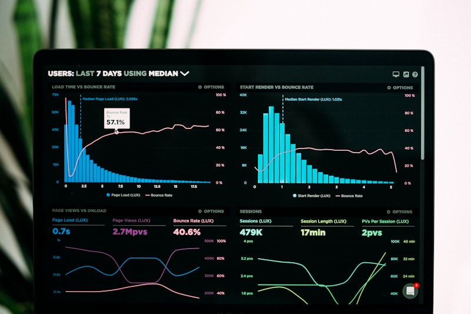
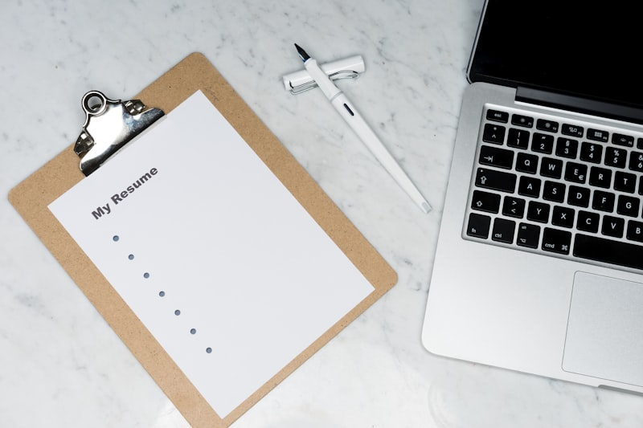

<!-- _class: titlepage -->

# Gestaltung und Design
## Grundlagen der visuellen Gestaltung
### 1. Semester Geovisualisierung

#### Betreuer Stefan Sauer
##### Lehrveranstaltung Wintersemester 2026/2027 · Mittwochs 10:00 – 11:30 Uhr · Raum C.2.05

---

<!-- _class: img-right -->

# Zu meiner Person
### FOL Stefan Sauer

- **Rolle:** Fachoberlehrer für Geovisualisierung
- **Schwerpunkte:**
  - 3D Visualisierung, AR, VR, XR
  - Visuelle Gestaltung & Layout
  - KI-unterstützte Kreativ- und Produktions-Workflows
- **Kontakt & Sprechstunde:**
  - Raum D.001f
  - E-Mail: `stefan.sauer@thws.de`
  - Telefon: +49 931 3511-8240

###### **FOL Stefan Sauer**   THWS · Geovisualisierung

---

<!-- _class: structural -->

# Aufbau der Lehrveranstaltung

### Rahmenbedingungen & Didaktisches Konzept

- **Umfang:** 4 SWS Gesamtmodul (5 ECTS)
  - **2 SWS** Grundlagen der Gestaltung (Suse Spanheimer)
  - **2 SWS** Gestaltung und Design G1 (Stefan Sauer)
- **Semesterziel:** Konzeption, Gestaltung und druckfertige Reinzeichnung eines großformatigen Plakats (**DIN A1**) zum Thema *„Mein Lieblingsort“*.
- **Lehrformat:** 12 Studio-Termine mit integriertem **Alpha-Prinzip** (Theorie $\rightarrow$ KI-Sprint $\rightarrow$ Art-Direction).

---
<!-- _class: img-right -->

# Ein "Alpha-Test"

Am 07.Juli 2026 habe ich einen Artikel über die Alpha-School in den USA gelesen.

**Folgende Fragen beschäftigen mich seither:**

- Ist unser Ausbildungskonzept noch zeitgemäß? Wie sieht die Zukunft der Ausbildung in unserem Bereich aus? Was muss ich ändern?
- Was macht Kreativität aus? Braucht es noch die "Genie-Künstler"? Was können KI-Systeme leisten, was der Mensch nicht kann?

###### [Der Standard](https://www.derstandard.at/story/3000000330273/fuer-75000-dollar-im-jahr-reiche-us-eltern-schicken-kinder-auf-ki-schulen) · 07.07.2026

---

<!-- 
_class: center
_backgroundColor: #e6007e
_color: #ffff00
-->

## <!-- fit --> Diese Lehrveranstaltung ist ein Experiment am lebenden Objekt!

 

# <!-- fit --> **An Ihnen!**

---

<!-- _class: img-right -->

# Das Vorbild: Alpha School
### Das Konzept des „2-Hour Learning“

- **Die Grundthese:**
  - Traditioneller Frontalunterricht ist zeitintensiv und nivelliert das Lerntempo.
- **2 Stunden adaptive KI-Mastery:**
  - Hard Skills & Fachwissen werden über KI-Tutoren im eigenen Lerntempo trainiert.
  - Fortschritt erst bei mindestens **90 % Verständnis (Mastery Learning)**.
- **Freiraum für echte Projekte:**
  - Der gewonnene Freiraum fließt vollständig in praktische Projekte, Kreativität & Kollaboration.

###### **Alpha School (USA)**   KI-Tutoring für Grundlagen schafft Zeit für Kreativität.

---

<!-- _class: img-right -->

# Der Rollenwandel
### „Guides, not Teachers“ – Vom Erklärer zum Mentor

- **Traditionelle Dozentenrolle:**
  - Dozierende erklären Werkzeugmenüs, Klickpfade und Standard-Shortcuts.
- **Die neue Dozentenrolle (Art Director & Coach):**
  - Individuelles Mentoring, Qualitätsprüfung und konzeptionelle Schärfung.
- **KI als persönlicher 1-on-1 Software-Tutor:**
  - Löst Klick-Blockaden, erklärt Shortcuts und filtert Werkzeug-Workflows *in Echtzeit*.

###### **Paradigmenwechsel**   Dozierende coachen Haltung und Qualität – die KI hilft beim Klickweg.

---

---

<!-- _class: structural -->

# Das Alpha-Prinzip je Lehrtermin

### Strukturierung der 90-minütigen Einheiten

1. **15 Min. Theorie-Flash:**
   Kompakte visuelle Inputs zu Gestaltgesetzen, Komposition, Typografie, Farbmanagement und Druckvorstufe.
2. **60 Min. Studio-Sprint & KI-Tutoring:**
   Eigenständige Software-Praxis in Adobe Photoshop / InDesign mit KI als interaktivem Co-Piloten für Workflows und Klickpfade.
3. **15 Min. Art-Director-Check-in & Zielerreichung:**
   Prüfung der erarbeiteten Artefakte, Peer-Feedback und Freigabe des Zwischenstandes.

---

<!-- _class: structural -->

# Semesterübersicht: 4 Blöcke · 12 Termine

- **Block 1: Konzept, Storytelling & Fotografie**
  - Termin 1 (07.10.): Kickoff, Storytelling & Motivwahl
  - Termin 2 (28.10.): Bildanalyse & RAW-Entwicklung
- **Block 2: Bildbearbeitung & Compositing (Photoshop)**
  - Termin 3 (04.11.): Nicht-destruktive Bildbearbeitung & Farbe
  - Termin 4 (11.11.): Freistellen & Maskierungstechniken
  - Termin 5 (18.11.): Visual Look, Retusche & Grading
- **Block 3: Layout, Raster & Typografie (InDesign)**
  - Termin 6 (25.11.): DIN A1 Setup & Rastersysteme
  - Termin 7 (02.12.): Typografische Hierarchie & Textgestaltung
  - Termin 8 (09.12.): Bild-Text-Integration & Effekte
- **Block 4: Review, Reinzeichnung & Druckvorstufe**
  - Termin 9 (16.12.): Zwischen-Pitch (Peer-to-Peer Review)
  - Termin 10 (23.12.): Layout-Feinschliff & Detailoptimierung
  - Termin 11 (13.01.): Preflight & Druck-PDF (PDF/X-4)
  - Termin 12 (20.01.): Demo Day & Plakat-Vernissage

---

<!-- _class: structural center large-text -->

# Block 1
### Konzept, Storytelling & Fotografie
#### Termine 01 & 02

---

<!-- _class: structural -->

# Termin 01: Kickoff, Storytelling & Motivwahl
### 07.10.2026 · Block 1

- **Fokus:** Visuelle Kommunikation & narrative Leitidee
- **Projekt:** DIN A1 Plakatgestaltung *„Mein Lieblingsort“*
- **Ablauf:**
  1. Theorie: Was macht ein Plakat stark?
  2. Praxis & KI: Moodboard, Farbwelt & Konzept-Sparring
  3. Zielerreichung: Konzept-Steckbrief & Foto-Auftrag

---

<!-- _class: img-right -->

# T01 · 1) Theorie: Plakatwirkung
### Fernwirkung vs. Nahwirkung

- **3-Sekunden-Regel:** Das Auge entscheidet in Millisekunden über Relevanz.
- **Fernwirkung (3–5 m):**
  - Klares Key-Visual und dominante Headline.
  - Hoher Kontrast, reduzierte Komplexität.
- **Nahwirkung (1–2 m & Leseabstand):**
  - Feine Details, Mikrotypografie, Storytelling.
- **Visual Hook:** Ein unerwarteter Blickwinkel erzeugt Neugier.

###### **Visuelle Hierarchie**   Plakate müssen auf Distanz fesseln und im Detail informieren.

---

<!-- _class: img-right small-text -->

# T01 · 2) Praxis: Konzept-Sprint & KI
### LLM als Sparringspartner für Moodboard & Story

- **Aufgabenstellung:**
  - Wähle deinen „Lieblingsort“ (urban, natürlich, geheim, historisch).
  - Entwickle ein 1-seitiges Moodboard mit Farbstimmung und 3 Kern-Keywords.
- **KI-Beratung & Prompt-Beispiel:**
  > *„Ich gestalte ein A1-Plakat über einen verlassenen Güterbahnhof bei Nebel. Schlage mir 3 gestalterische Leitmotive, eine 4-teilige Farbpalette mit Hex-Codes und 3 Metaphern für die Bildsprache vor.“*
- **Tipp:** Nutze KI für Assoziationsketten – triff die finale Designentscheidung selbst.

###### **Konzeptarbeit**   Vom diffusen Gedanken zum präzisen Design-Briefing.

---

<!-- _class: img-right small-text -->

# T01 · 3) Zielerreichung & Check-in
### Welche Ergebnisse müssen vorliegen?

- **Ergebnis-Checkliste:**
  - [ ] 1 ausgewählter Lieblingsort mit klarer Kernbotschaft.
  - [ ] 3 verbindliche Design-Keywords (z. B. *rau, mystisch, industriell*).
  - [ ] Definiertes Moodboard (Farben, Bildstil, typografische Anmutung).
- **Auftrag bis Termin 2:**
  - Aufnahme von **20–30 hochauflösenden RAW-/Fotos** vor Ort:
  - *Totale, Halbtotale, Makro/Detail, verschiedene Lichtstimmungen*.
- **Art-Director-Check:** Ist die Leitidee visuell tragfähig für ein A1-Format?

###### **Deliverable T01**   Freigegebenes Konzept & Briefing für das Fotoshooting.

---

<!-- _class: structural -->

# Termin 02: Bildanalyse & RAW-Entwicklung
### 28.10.2026 · Block 1

- **Fokus:** Fototechnik, Bildaufbau & digitale Dunkelkammer
- **Software:** Adobe Photoshop (Camera Raw Filter) + KI
- **Ablauf:**
  1. Theorie: Kompositionsregeln & Dynamikumfang
  2. Praxis & KI: RAW-Import, Belichtungsausgleich & Schärfung
  3. Zielerreichung: Finales Master-Foto für das Plakat

---

<!-- _class: img-right -->

# T02 · 1) Theorie: Bildkomposition
### Führungslinien & Goldener Schnitt

- **Drittel-Regel & Goldener Schnitt:**
  - Platzierung des Hauptfokus abseits der toten Mitte.
- **Führungslinien & Fluchtpunkte:**
  - Gezielt den Blick des Betrachters ins Bild leiten.
- **Licht & Kontrastumfang:**
  - Zeichnung in den Tiefen und Lichtern erhalten (Histogramm).
- **Formatbewusstsein:**
  - Hochformatiges Denken für das DIN A1 Seitenverhältnis ($1 : \sqrt{2}$).

###### **Komposition**   Führungslinien lenken das Auge zielsicher zum visuellen Zentrum.

---

<!-- _class: img-right small-text -->

# T02 · 2) Praxis: Camera Raw & KI-Workflow
### Digitale Negativentwicklung in Photoshop

- **Aufgabenstellung:**
  - Sichte deine 20–30 Fotos und wähle die Top 3 Kandidaten.
  - Führe eine vollständige RAW-Entwicklung im Camera-Raw-Filter durch.
- **Arbeitsschritte:**
  - Weißabgleich kalibrieren, Belichtung/Kontrast justieren.
  - Lichter absenken, Tiefen aufhellen, Textur & Klarheit gezielt dosieren.
- **KI-Beratung:**
  > *„Mein Smartphone-Foto hat starkes Bildrauschen in den Schatten und überstrahlte Wolken. Welche Regler im Camera-Raw-Filter bringen Zeichnung zurück, ohne Artefakte zu erzeugen?“*

###### **RAW-Entwicklung**   Maximaler Dynamikumfang als Basis für das spätere Compositing.

---

<!-- _class: img-right small-text -->

# T02 · 3) Zielerreichung & Check-in
### Welche Ergebnisse müssen vorliegen?

- **Ergebnis-Checkliste:**
  - [ ] 1 Hauptmotiv ausgewählt (min. 12 Megapixel, hochauflösend).
  - [ ] Saubere Tonwertkorrektur ohne Tonwertabrisse (kein Clipping im Histogramm).
  - [ ] Ausgewogener Weißabgleich und optimierte Schärfe/Entrauschung.
  - [ ] Datei als verlustfreies Master (`.psd` oder `.tif`) gesichert.
- **Art-Director-Check:**
  - Eignet sich der Bildaufbau für spätere Typografie-Überlagerungen?

###### **Deliverable T02**   Das technisch ausbelichtete Hauptmotiv steht bereit.

---

<!-- _class: structural center large-text -->

# Block 2
### Bildbearbeitung & Compositing in Photoshop
#### Termine 03, 04 & 05

---

<!-- _class: structural -->

# Termin 03: Nicht-destruktive Bildbearbeitung
### 04.11.2026 · Block 2

- **Fokus:** Ebenenarchitektur, Farbstimmung & Lichtführung
- **Software:** Adobe Photoshop + KI-Prompting
- **Ablauf:**
  1. Theorie: Farbpsychologie & Lichtwirkung
  2. Praxis & KI: Einstellungsebenen, Schnittmasken & Gradation
  3. Zielerreichung: Sauber strukturierter non-destruktiver Ebenenbaum

---

<!-- _class: img-right -->

# T03 · 1) Theorie: Farbpsychologie
### Emotion & Raumwirkung durch Farbe

- **Farbklima & Tonalität:**
  - Warme Farbtöne (Rot, Orange) wirken nah, aktiv und einladend.
  - Kühle Farbtöne (Blau, Cyan) schaffen Distanz, Ruhe und Weite.
- **Komplementär- & Simultankontrast:**
  - Gezielter Einsatz von Akzentfarben zur Aufmerksamkeitssteuerung.
- **Atmosphärische Tiefe:**
  - Vordergrund kontrastreich/gesättigt $\rightarrow$ Hintergrund weicher/aufgehellt.

###### **Farbdynamik**   Gezielte Farbkontraste steuern die emotionale Grundstimmung.

---

<!-- _class: img-right small-text -->

# T03 · 2) Praxis: Non-Destructive Workflow
### Arbeiten mit Gradationskurven & Schnittmasken

- **Aufgabenstellung:**
  - Optimiere das Hauptmotiv ausschließlich über **Einstellungsebenen**.
  - Erstelle getrennte Korrekturen für Vorder-, Mittel- und Hintergrund.
- **Kerntechniken:**
  - Gradationskurven für S-Kurven-Kontraste.
  - Farbbalance & selektive Farbkorrektur mit Schnittmasken (`Alt + Klick`).
- **KI-Beratung:**
  > *„Wie isoliere ich in Photoshop per Gradationskurve gezielt die Tiefen in einer Schnittmaske, ohne die neutralen Haut- und Mitteltöne zu beeinflussen?“*

###### **Non-Destructive**   Originalpixel bleiben zu 100 % unangetastet.

---

<!-- _class: img-right small-text -->

# T03 · 3) Zielerreichung & Check-in
### Welche Ergebnisse müssen vorliegen?

- **Ergebnis-Checkliste:**
  - [ ] Keine direkten Bildmanipulationen auf der Hintergrundebene.
  - [ ] Benannte Einstellungsebenen und Farbcodierung im Ebenenbedienfeld.
  - [ ] Mindestens 2 Schnittmasken für zonale Farb-/Lichtkorrekturen.
  - [ ] Visuell spürbare Raumtiefe durch gezielte Lichtführung.
- **Art-Director-Check:**
  - Wirkt das Motiv flach oder transportiert es eine plastische Raumatmosphäre?

###### **Deliverable T03**   Eine professionell strukturierte Photoshop-Masterdatei.

---

<!-- _class: structural -->

# Termin 04: Freistellen & Maskieren
### 11.11.2026 · Block 2

- **Fokus:** Figur-Grund-Trennung, Vektormasken & Smart-Objekte
- **Software:** Adobe Photoshop + KI-Auswahltools
- **Ablauf:**
  1. Theorie: Gestaltgesetze der visuellen Wahrnehmung
  2. Praxis & KI: Zeichenstift (Pfade), Auswählen & Maskieren
  3. Zielerreichung: Makelloser Freisteller auf Smart-Objekt

---

<!-- _class: img-right -->

# T04 · 1) Theorie: Figur & Grund
### Wahrnehmungsebenen im Plakatdesign

- **Gestaltgesetz der Geschlossenheit & Nähe:**
  - Das menschliche Gehirn trennt automatisch Vordergrund (Figur) vom Hintergrund (Grund).
- **Kantenkontrast & Schärfentiefe:**
  - Scharfe Kanten ziehen den Blick an; weiche Kanten erzeugen Raum.
- **Ebenenstaffelung:**
  - Freigestellte Bildelemente ermöglichen das spätere Hinter- oder Vor-die-Schrift-Legen in InDesign.

###### **Gestaltgesetze**   Klare Trennung von Figur und Raum schafft visuelle Ordnung.

---

<!-- _class: img-right small-text -->

# T04 · 2) Praxis: Präzisionsmaskierung & KI
### Zeichenstift, Masken-Feinschliff & Smart-Objekt

- **Aufgabenstellung:**
  - Isoliere ein zentrales Element (Architektur, Person, Landmarke) deines Motivs.
  - Konvertiere das freigestellte Element in ein **Smart-Objekt**.
- **Methoden-Mix:**
  - Harte Kanten: Vektorpuffer mit dem Zeichenstift-Werkzeug ($P$).
  - Organische Kanten (Haare/Bäume): *Auswählen und Maskieren* mit Kanten-Verbessern-Pinsel.
- **KI-Beratung:**
  > *„Erkläre mir den Shortcut-Workflow, um in Photoshop einen Pfad in eine Vektormaske umzuwandeln und Kanten um 0,5 px nach innen zu verlegen.“*

###### **Freistelltechnik**   Präzision an den Konturen entscheidet über die Glaubwürdigkeit.

---

<!-- _class: img-right small-text -->

# T04 · 3) Zielerreichung & Check-in
### Welche Ergebnisse müssen vorliegen?

- **Ergebnis-Checkliste:**
  - [ ] Mindestens 1 saubere Ebenenmaske ohne Farbsäume oder Fransen.
  - [ ] Kein zerstörerisches Löschen mit dem Radiergummi.
  - [ ] Freigestelltes Element liegt als **Smart-Objekt** vor (skalierbar & austauschbar).
  - [ ] Kontrollansicht auf schwarzem, weißem und 50%-grauem Hintergrund bestanden.
- **Art-Director-Check:**
  - Halten die Kanten der 100%-Zoomansicht für den A1-Großdruck stand?

###### **Deliverable T04**   Perfekt maskiertes Bildelement, bereit für die Ebenenkomposition.

---

<!-- _class: structural -->

# Termin 05: Visual Look, Retusche & Grading
### 18.11.2026 · Block 2

- **Fokus:** Störelimination, Generatives Füllen & Color-Grading
- **Software:** Adobe Photoshop (Generative AI & Lookups)
- **Ablauf:**
  1. Theorie: Bildharmonie & Blickberuhigung
  2. Praxis & KI: Retuschewerkzeuge, Generatives Erweitern & Verlaufsumsetzung
  3. Zielerreichung: Final freigegebenes Key-Visual für InDesign

---

<!-- _class: img-right -->

# T05 · 1) Theorie: Bildharmonie
### Blickführung durch Reduktion

- **Entrümpeln des Bildraums:**
  - Schilder, Müll, Passanten und stürzende Linien lenken vom Hauptmotiv ab.
- **Cinematisches Color-Grading:**
  - Einheitlicher Farb-Look bindet zusammengesetzte Elemente harmonisch zusammen.
- **Split-Toning & Farbharmonien:**
  - Komplementäre Farbgebung für Lichter (z. B. Warmgold) und Schatten (z. B. Tiefcyan).

###### **Visual Look**   Farbgrading erzeugt emotionale Dichte und eine filmische Atmosphäre.

---

<!-- _class: img-right small-text -->

# T05 · 2) Praxis: Retusche & Look-Entwicklung
### High-End Finishing & Generatives Erweitern

- **Aufgabenstellung:**
  - Bereinige Bildstörungen mit dem Reparatur-Pinsel und Ausbessern-Werkzeug.
  - Erweitere bei Bedarf den Bildrand generativ für Textfreiräume im A1-Format.
  - Erstelle einen konsistenten Farblook über Verlaufsumsetzungen / LUTs.
- **KI-Beratung:**
  > *„Wie nutze ich Photoshop Generative Fill, um einen Bildrand um 20 % nach oben zu erweitern, sodass eine fotorealistische Himmelsfläche für Typografie entsteht?“*

###### **Finishing**   Bereinigte Flächen schaffen Platz für typografische Botschaften.

---

<!-- _class: img-right small-text -->

# T05 · 3) Zielerreichung & Check-in
### Welche Ergebnisse müssen vorliegen?

- **Ergebnis-Checkliste:**
  - [ ] Keine störenden Artefakte oder störende Bildelemente im Motiv.
  - [ ] Bildformat und Auflösung entsprechen A1 (min. 150–200 ppi effektiv).
  - [ ] Stimmiger, cineastischer Gesamt-Farblook angewendet.
  - [ ] Photoshop-Masterdatei (`.psd`) final gespeichert und schreibgeschützt archiviert.
- **Art-Director-Check:**
  - **Finale Freigabe des Key-Visuals!** Ab jetzt wechseln wir in Adobe InDesign.

###### **Deliverable T05**   Das finale Key-Visual steht für das Layout-Setup bereit.

---

<!-- _class: structural center large-text -->

# Block 3
### Layout, Rastersysteme & Typografie in InDesign
#### Termine 06, 07 & 08

---

<!-- _class: structural -->

# Termin 06: DIN A1 Setup & Rastersysteme
### 25.11.2026 · Block 3

- **Fokus:** Großformat-Geometrie, Satzspiegel & Gestaltungsraster
- **Software:** Adobe InDesign
- **Ablauf:**
  1. Theorie: Proportionen, Randabstände & Rastersysteme
  2. Praxis & KI: Dokumentanlage DIN A1, 3 mm Anschnitt, Spaltenraster
  3. Zielerreichung: Fertiges InDesign-Layoutgerüst mit Musterseiten

---

<!-- _class: img-right -->

# T06 · 1) Theorie: Ordnung im Großformat
### Satzspiegel & Rastersysteme

- **DIN A1 Abmessungen:**
  - $594 \times 841\text{ mm}$ im Hochformat.
- **Randabstände im Plakat:**
  - Plakate brauchen „Luft“: Stege dürfen im Großformat niemals zu eng bemessen sein (min. 25–40 mm).
- **Modulares Raster (6- oder 12-Spaltigkeit):**
  - Schafft mathematische Ordnung, Rhythmus und flexible Text-Bild-Kombinationen.
- **Anschnitt (Bleed):**
  - Obligatorische **3 mm Beschnittzugabe** für den randabfallenden Druck.

###### **Layoutraster**   Unsichtbare Hilfslinien schaffen visuelle Ruhe und Klarheit.

---

<!-- _class: img-right small-text -->

# T06 · 2) Praxis: InDesign Setup & KI
### Mathematische Präzision im InDesign-Dokument

- **Aufgabenstellung:**
  - Lege ein neues Dokument an: **DIN A1**, 1 Seite, Anschnitt 3 mm rundum.
  - Richte auf der **Musterseite A** ein 12-Spalten-Raster mit 5 mm Spaltenabstand ein.
  - Definiere ein Grundlinienraster (passend zur späteren Grundschrift).
- **KI-Beratung:**
  > *„Berechne mir für ein DIN A1 Plakat harmonische Satzspiegel-Ränder (Kopf, Bund, Fuß, Außen) nach dem klassischen Buchausgleich und erkläre die Einrichtung in InDesign.“*

###### **Dokumentanlage**   Ein sauberes Fundament verhindert Fehler in der Reinzeichnung.

---

<!-- _class: img-right small-text -->

# T06 · 3) Zielerreichung & Check-in
### Welche Ergebnisse müssen vorliegen?

- **Ergebnis-Checkliste:**
  - [ ] Dokument exakt auf $594 \times 841\text{ mm}$ mit 3 mm Anschnitt angelegt.
  - [ ] Hilfslinien und Spaltenraster sauber auf der Musterseite/Elternseite definiert.
  - [ ] Satzspiegel bietet ausreichend Randabstand für Rahmung und Schnitttoleranzen.
  - [ ] InDesign-Datei strukturiert unter `01_Layout_A1_Setup.indd` gesichert.
- **Art-Director-Check:**
  - Atmet der Raum oder kleben die Ränder zu nah an der Dokumentkante?

###### **Deliverable T06**   Das geometrische Layoutgerüst ist verbindlich aufgesetzt.

---

<!-- _class: structural -->

# Termin 07: Typografische Hierarchie & Text
### 02.12.2026 · Block 3

- **Fokus:** Lesedistanzen, Schriftmischung & KI-Copywriting
- **Software:** Adobe InDesign + LLM-Textassistenz
- **Ablauf:**
  1. Theorie: Die 3 Ebenen der Plakattypografie
  2. Praxis & KI: Absatzformate, optischer Randausgleich & Textgenerierung
  3. Zielerreichung: Typografisch hierarchisiertes Plakatlayout

---

<!-- _class: img-right -->

# T07 · 1) Theorie: Typo auf Distanz
### Die drei Informationsebenen

- **Ebene 1: Headline (Fernbereich 3–5 m)**
  - Groß, plakativ, emotional. Schriftgröße ca. 72–120 pt+.
- **Ebene 2: Subline / Teaser (Nahbereich 1–2 m)**
  - Erklärt den Kontext, Schriftgröße ca. 28–48 pt.
- **Ebene 3: Bodycopy / Fakten (Leseabstand 0,5 m)**
  - Detailinformationen, Koordinaten, Infotext. Schriftgröße ca. 14–20 pt.
- **Schriftmischung:**
  - Maximal 2 Schriftfamilien (z. B. markante Grotesk + elegante Antiqua).

###### **Schrifthierarchie**   Klare Größenkontraste leiten den Blick von Wichtig zu Detail.

---

<!-- _class: img-right small-text -->

# T07 · 2) Praxis: Formate & KI-Copywriting
### Absatzformate einrichten & Texte schleifen

- **Aufgabenstellung:**
  - Lege in InDesign Absatzformate an (`H1_Headline`, `H2_Subline`, `P_Body`, `Meta_Info`).
  - Aktiviere die **Optische Steganpassung** (Optical Margin Alignment).
  - Nutze ein LLM, um prägnante, poetische oder informative Texte für deinen Ort zu schreiben.
- **KI-Beratung:**
  > *„Schreibe mir 3 Varianten für eine kurze, packende Subline (max. 15 Wörter) und einen Bodytext (max. 60 Wörter) über die historische Atmosphäre der Schweinfurter Mainlände.“*

###### **Typo-Automation**   Absatzformate garantieren konsistente Stile im gesamten Dokument.

---

<!-- _class: img-right small-text -->

# T07 · 3) Zielerreichung & Check-in
### Welche Ergebnisse müssen vorliegen?

- **Ergebnis-Checkliste:**
  - [ ] Saubere Absatzformate ohne lokale Überschreibungen angelegt.
  - [ ] Eindeutige typografische Hierarchie (Headline dominiert visuell).
  - [ ] Keine Schriftverzerrungen (vertikal/horizontal auf 100 %).
  - [ ] Ausreichender Kontrast zwischen Text und Hintergrund (Lesbarkeit).
- **Art-Director-Check:**
  - Funktioniert die Lesereihenfolge intuitiv innerhalb von 2 Sekunden?

###### **Deliverable T07**   Das Plakat besitzt eine funktionierende Text- und Schrifthierarchie.

---

<!-- _class: structural -->

# Termin 08: Bild-Text-Integration & Effekte
### 09.12.2026 · Block 3

- **Fokus:** Verknüpfungsmanagement, Textumfluss & Weißraum
- **Software:** Adobe InDesign & Photoshop im Verbund
- **Ablauf:**
  1. Theorie: Mikrotypografie & die Kraft des Weißraums
  2. Praxis & KI: PSD-Smart-Platzierung, Textumfluss um Freistellerpfade
  3. Zielerreichung: Integriertes Gesamtlayout (Bild + Typografie)

---

<!-- _class: img-right -->

# T08 · 1) Theorie: Weißraum & Fusion
### Harmonie zwischen Bild und Schrift

- **Mut zur Leere (Negative Space):**
  - Weißraum ist kein verschenkter Platz, sondern der stärkste Verstärker für Inhalt.
- **Text-Bild-Verschmelzung:**
  - Schrift hinter freigestellten Bildelementen erzeugt Dreidimensionalität.
- **Mikrotypografie:**
  - Zeilenabstand (Leading) und optischer Zeilenausgleich für ruhigen Grauwert.
- **Keine visuellen Konkurrenzen:**
  - Das Auge braucht einen eindeutigen Einstiegspunkt.

###### **Negativer Raum**   Erst durch bewusste Leere entfaltet die Gestaltung ihre volle Wucht.

---

<!-- _class: img-right small-text -->

# T08 · 2) Praxis: Textumfluss & PSD-Linking
### Interaktion zwischen InDesign & Photoshop

- **Aufgabenstellung:**
  - Platziere deine Photoshop-Masterdatei (`.psd`) nativ in InDesign ($Strg + D$).
  - Verwende den Freistellpfad aus Photoshop für einen dynamischen **Textumfluss** in InDesign.
  - Experimentiere mit Ebeneneffekten (z. B. Multiplizieren, Farbig abwedeln).
- **KI-Beratung:**
  > *„Wie binde ich eine mehrschichtige PSD in InDesign ein, sodass ich im Verknüpfungsbedienfeld einzelne Ebenen ein- und ausschalten und den Pfad für Textumfluss nutzen kann?“*

###### **Smart Link**   Native Photoshop-Verknüpfungen halten Änderungen verlustfrei synchron.

---

<!-- _class: img-right small-text -->

# T08 · 3) Zielerreichung & Check-in
### Welche Ergebnisse müssen vorliegen?

- **Ergebnis-Checkliste:**
  - [ ] Photoshop-Datei nativ verknüpft (keine fehlenden Links im Bedienfeld).
  - [ ] Harmonische Text-Bild-Interaktion ohne störende Überschneidungen.
  - [ ] Keine Textverdeckung wichtiger Bildelemente.
  - [ ] Ausgewogenes Verhältnis zwischen Bilddynamik und Weißraum.
- **Art-Director-Check:**
  - Bilden Typografie und Fotografie eine unzertrennliche visuelle Einheit?

###### **Deliverable T08**   Vollständig integrierter Layout-Entwurf vor der Review-Phase.

---

<!-- _class: structural center large-text -->

# Block 4
### Review, Reinzeichnung & Druckvorstufe
#### Termine 09, 10, 11 & 12

---

<!-- _class: structural -->

# Termin 09: Zwischen-Pitch & Art Review
### 16.12.2026 · Block 4

- **Fokus:** Peer-to-Peer Feedback, Kriterienmatrix & Design-Kritik
- **Format:** Speed-Pitching & Art-Direction Review
- **Ablauf:**
  1. Theorie: Professionelle Design-Kritik (Kriterien statt Geschmack)
  2. Praxis: 2-Minuten-Pitch in 3er-Gruppen anhand der Checkliste
  3. Zielerreichung: Schriftliches Feedbackprotokoll für den Feinschliff

---

<!-- _class: img-right -->

# T09 · 1) Theorie: Design-Kritik
### Feedback professionell geben & empfangen

- **Deskriptiv statt wertend:**
  - Nicht *„Gefällt mir nicht“*, sondern *„Die Subline konkurriert im Kontrast mit der Gebäude-Kante“*.
- **Die 4 Säulen des Plakat-Checks:**
  1. **Story & Idee:** Wird der Lieblingsort spürbar?
  2. **Hierarchie & Lesbarkeit:** Stimmt die Leserichtung?
  3. **Bildqualität & Schnitt:** Sitzen Masken und Bilddetails?
  4. **Komposition:** Ist das Layout ausbalanciert?

###### **Peer Review**   Konstruktives Feedback schärft den Blick für Details und Fehler.

---

<!-- _class: img-right small-text -->

# T09 · 2) Praxis: Speed-Pitching im Studio
### Strukturierte Peer-Reviews in 3er-Teams

- **Ablauf des Sprints:**
  - **2 Min.:** Designer/in pitcht das Plakat (Konzept, Hürden, Zielgruppe).
  - **3 Min.:** 2 Peers analysieren das Layout anhand des standardisierten Bewertungsbogens.
  - **1 Min.:** Konsolidierung der 3 wichtigsten Handlungsempfehlungen.
- **KI-Beratung:**
  > *„Formuliere eine strukturierte Checkliste für ein Design-Review eines Großflächenplakats mit Fokus auf Typografie, Kontrastverhältnisse und Bildschärfe.“*

###### **Studio-Sprint**   Schnelle Feedbackschleifen decken tote Winkel in der Gestaltung auf.

---

<!-- _class: img-right small-text -->

# T09 · 3) Zielerreichung & Check-in
### Welche Ergebnisse müssen vorliegen?

- **Ergebnis-Checkliste:**
  - [ ] Plakat erfolgreich im 2-Minuten-Pitch präsentiert.
  - [ ] Ausgefüllter Feedbackbogen von mindestens 2 Peers erhalten.
  - [ ] Konkrete To-Do-Liste mit priorisierten Korrekturpunkten erstellt.
- **Art-Director-Check:**
  - Wurden fundamentale Konzeptschwächen vor der Detailtypografie identifiziert?

###### **Deliverable T09**   Verbindliche Roadmap für den typografischen Feinschliff.

---

<!-- _class: structural -->

# Termin 10: Layout-Feinschliff & Detailtypo
### 23.12.2026 · Block 4

- **Fokus:** Mikrotypografie, GREP-Stile & satztechnische Korrektheit
- **Software:** Adobe InDesign
- **Ablauf:**
  1. Theorie: Satzfehler vermeiden (Witwen, Waisen, Trennungen)
  2. Praxis & KI: GREP-Stile für geschützte Leerzeichen & Sonderzeichen
  3. Zielerreichung: Makelloser Satz vor der Weihnachtspause

---

<!-- _class: img-right -->

# T10 · 1) Theorie: Detailtypografie
### Handwerkliche Perfektion im Mengensatz

- **Satzfehler eliminieren:**
  - Keine **Hurenkinder** (letzte Zeile am Spaltenanfang) oder **Schusterjungen** (erste Zeile am Spaltenende).
  - Keine alleinstehenden Einzelwörter am Absatzende (Witwen).
- **Typografische Sonderzeichen:**
  - Echte Anführungszeichen („...“), Bis-Striche (Geviert/Halbgeviert – statt Bindestrich -).
  - Geschützte Leerzeichen bei Abkürzungen (z. B. *z. B.*, *5 ECTS*).

###### **Mikrotypografie**   Der Unterschied zwischen Amateur und Profi liegt in den Details.

---

<!-- _class: img-right small-text -->

# T10 · 2) Praxis: GREP & Trennungen in InDesign
### Satzregeln automatisieren

- **Aufgabenstellung:**
  - Richte GREP-Stile in den Absatzformaten ein, um einbuchstabige Wörter und Einheiten automatisch mit geschützten Leerzeichen zu binden.
  - Optimiere die Silbentrennung (maximal 2 Trennungen in Folge, min. 3 Buchstaben vor/nach Trennung).
- **KI-Beratung:**
  > *„Gib mir den genauen GREP-Ausdruck für InDesign, der verhindert, dass kurze Wörter wie 'und', 'in', 'am' oder Zahlen am Zeilenende alleine stehen bleiben.“*

###### **GREP-Power**   Automatisierte Typoregeln garantieren fehlerfreien Umbruch.

---

<!-- _class: img-right small-text -->

# T10 · 3) Zielerreichung & Check-in
### Welche Ergebnisse müssen vorliegen?

- **Ergebnis-Checkliste:**
  - [ ] Keine Satzfehler (keine Witwen, keine unschönen Trennungen).
  - [ ] Korrekte typografische Anführungszeichen und Gedankenstriche gesetzt.
  - [ ] GREP-Stile in allen Absatzformaten aktiv.
  - [ ] Entwurf bereit für die Druckvorstufe im neuen Jahr.
- **Art-Director-Check:**
  - Individuelle 1-on-1 Freigabe vor der Weihnachtspause.

###### **Deliverable T10**   Satztechnisch perfektes Layout vor dem finalen Druckexport.

---

<!-- _class: structural -->

# Termin 11: Preflight & Druck-PDF (PDF/X)
### 13.01.2027 · Block 4

- **Fokus:** Druckvorstufe, Farbprofile, effektive ppi & PDF/X-4
- **Software:** Adobe InDesign Preflight & Adobe Acrobat Pro
- **Ablauf:**
  1. Theorie: Farbräume (RGB vs. CMYK), Gesamtfarbauftrag & PDF/X-Standards
  2. Praxis & KI: Preflight-Profil erstellen, Anschnitt prüfen, PDF/X-4 Export
  3. Zielerreichung: Technisch validierte, druckfähige PDF-Datei

---

<!-- _class: img-right -->

# T11 · 1) Theorie: Druckvorstufe
### Vom Monitor zum Großformatdruck

- **Farbräume & Profile:**
  - Umwandlung von sRGB/AdobeRGB in standardisiertes **ISO Coated v2 (FOGRA39)** oder **PSO Coated v3 (FOGRA51)**.
- **Auflösung im Großformat:**
  - Effektive ppi $\ge 150\text{--}200\text{ ppi}$ bei DIN A1 absolut ausreichend für optimalen Betrachtungsabstand.
- **Gesamtfarbauftrag (TIC):**
  - Maximal 300–320 % zur Vermeidung von Farbablegen.
- **PDF/X-4 Standard:**
  - Erhält Transparenzen nativ für modernes RIP-Rendering.

###### **Farbmanagement**   Verbindliche Farbprofile garantieren farbechte Druckergebnisse.

---

<!-- _class: img-right small-text -->

# T11 · 2) Praxis: Preflight & PDF-Export
### Fehleranalyse & PDF/X-4 Ausgabe

- **Aufgabenstellung:**
  - Erstelle ein InDesign-Preflight-Profil: Prüfung auf RGB-Bilder, fehlende Schriften, Übersatztext und Auflösung $< 150\text{ ppi}$.
  - Exportiere die Druckdatei als **PDF/X-4:2010** mit 3 mm Anschnitt und Schnittmarken.
- **KI-Beratung:**
  > *„Mein InDesign-Preflight meldet 'Übersatztext' und ein Bild mit 'effektiver ppi: 112'. Wie lokalisiere und behebe ich beides vor dem PDF-Export?“*

###### **Preflight-Check**   Automatische Fehlerüberprüfung verhindert teure Fehldrucke.

---

<!-- _class: img-right small-text -->

# T11 · 3) Zielerreichung & Check-in
### Welche Ergebnisse müssen vorliegen?

- **Ergebnis-Checkliste:**
  - [ ] InDesign-Preflight zeigt **grünes Licht** (0 Fehler).
  - [ ] Exportierte PDF/X-4 Datei geöffnet in Adobe Acrobat Pro.
  - [ ] Schnittmarken und 3 mm Anschnitt sichtbar und korrekt angelegt.
  - [ ] Keine fehlenden Schriften (alle Schriften eingebettet).
- **Art-Director-Check:**
  - **Druckfreigabe (Imprimatur)!** Datei geht in den Plotter/Druck.

###### **Deliverable T11**   Validierte PDF/X-4 Datei, bereit für die Plakatproduktion.

---

<!-- _class: structural -->

# Termin 12: Demo Day & Vernissage
### 20.01.2027 · Block 4

- **Fokus:** Design-Pitch, Portfolio-Präsentation & Reflexion
- **Format:** Plakat-Ausstellung & 90-Sekunden-Präsentation
- **Ablauf:**
  1. Theorie: Storytelling in der Designpräsentation
  2. Praxis: Live-Vernissage & 90-Sekunden-Speed-Präsentation
  3. Zielerreichung: Erfolgreicher Modulabschluss & Reflexion

---

<!-- _class: img-right -->

# T12 · 1) Theorie: Design präsentieren
### Die Kunst der visuellen Argumentation

- **Die 3 Säulen des 90-Sekunden-Pitches:**
  1. **Konzept & Hook (30s):** Warum dieser Lieblingsort? Welche Geschichte erzählt das Motiv?
  2. **Designentscheidungen (30s):** Warum genau diese Farbwelt, Typohierarchie und Rasterschnittstellen?
  3. **KI- & Tool-Erkenntnis (30s):** Welche technische Hürde wurde mit KI-Assistenz gemeistert?
- **Souveränes Auftreten:**
  - Stehe hinter deinen Gestaltungsentscheidungen.

###### **Vernissage**   Die eigene Arbeit vor Publikum sichtbar und erlebbar machen.

---

<!-- _class: img-right small-text -->

# T12 · 2) Praxis: Die Plakat-Vernissage
### Ausstellung & Speed-Präsentation

- **Ablauf des Demo Days:**
  - Präsentation der A1-Plakate im Ausstellungsraum / Großbild-Screen.
  - Jeder Studierende hält den **90-Sekunden-Pitch**.
  - Peer-Voting & professionelles Abschluss-Feedback.
- **KI-Beratung:**
  > *„Strukturiere mir ein prägnantes 90-Sekunden-Sprechskript für die Vorstellung meines A1-Plakats vor Professoren und Kommilitonen.“*

###### **Demo Day**   Feierlicher Abschluss und Präsentation der Arbeitsergebnisse.

---

<!-- _class: img-right small-text -->

# T12 · 3) Zielerreichung & Semesterabschluss
### Welche Ergebnisse müssen vorliegen?

- **Finale Abgabe-Checkliste:**
  - [ ] Gedrucktes / ausstellungsfertiges **DIN A1 Plakat**.
  - [ ] Digitales Abgabepaket (InDesign-Paket inkl. Fonts & Links + PDF/X-4).
  - [ ] 1-seitiger Reflexionsbericht über den Einsatz von KI-Tools im Workflow.
  - [ ] Erfolgreicher 90-Sekunden-Pitch absolviert.
- **Glückwunsch zum erfolgreichen Abschluss von Gestaltung und Design G1!**

###### **Modulabschluss**   Erfolgreicher Kompetenzgewinn in visueller Gestaltung & Medienpraxis.

---

<!-- _class: structural center large-text -->

# Vielen Dank!
### Fragen & Sprechstunde
#### FOL Stefan Sauer · Fakultät Geovisualisierung · THWS
